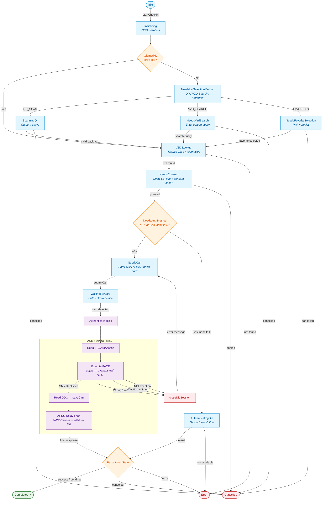

# PoPP Module Flow

## States

| State | Description |
|-------|-------------|
| **Idle** | Initial state, no activity |
| **Initializing** | ZETA/OAuth client initialization |
| **NeedsLeiSelectionMethod** | User chooses how to find the pharmacy (QR, search, favorites) |
| **ScanningQr** | Camera scanning QR code |
| **NeedsVzdSearch** | User enters pharmacy search query |
| **NeedsFavoriteSelection** | User picks from saved favorites |
| **NeedsConsent** | Native consent sheet with pharmacy info |
| **NeedsAuthMethod** | Choose eGK or GesundheitsID |
| **NeedsCan** | Enter 6-digit CAN or select known card |
| **WaitingForCard** | NFC — hold eGK to device |
| **AuthenticatingEgk** | PACE + APDU relay with eGK |
| **AuthenticatingGid** | GesundheitsID authentication |
| **Completed** | Check-in succeeded or pending |
| **Cancelled** | User cancelled or consent denied |
| **Error** | LEI not found, service error, etc. |

## Key Design Decisions

- **Async PACE overlap**: PACE runs in a `Deferred` while the PoPP module's initial HTTP request goes out in parallel (~200ms saved)
- **Early error detection**: If `paceDeferred.isCompleted` before returning, wrong CAN is caught immediately without losing the overlap on the happy path
- **APDU file caching**: Immutable card files (certificates, VERSION2) are cached by ICCSN — subsequent check-ins with the same card skip NFC reads
- **CAN persistence**: `saveCan()` after PACE stores the CAN so the card appears in known cards for future check-ins
